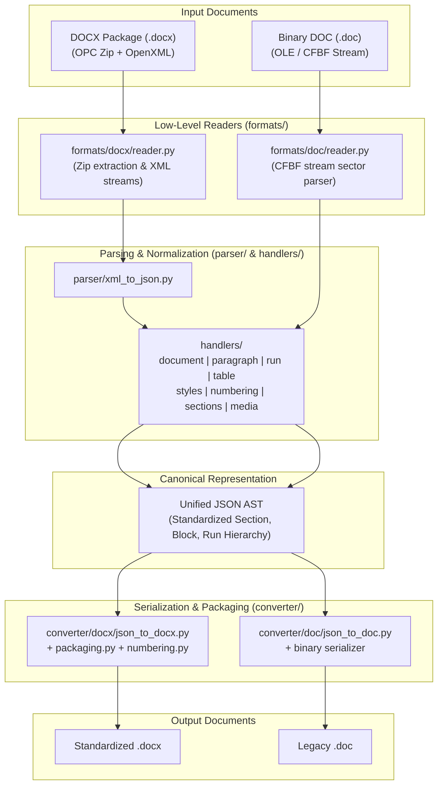

# docx-bridge Documentation Hub

Welcome to the comprehensive documentation suite for **docx-bridge**, a high-performance Python engine for bi-directional conversion, manipulation, and AST (Abstract Syntax Tree) representation of Word documents.

This documentation suite is engineered with **section-wise depth** and **AI-compatible structured formats** (semantic metadata, strict JSON schemas, OpenXML tag matrices, and LLM prompting blueprints).

---

## 📚 Documentation Index

```
docs/
├── README.md                           # Master Documentation Hub (This File)
│
├── docx/                               # ECMA-376 / ISO/IEC 29500 OpenXML (.docx)
│   ├── README.md                       # DOCX Overview, Architecture & Quick Reference
│   ├── 01-architecture-and-pipeline.md # OPC Packaging, Zip Container, Readers & Writers
│   ├── 02-schema-and-ast.md            # Unified JSON AST Schema (Simple vs Raw Specifications)
│   ├── 03-handlers-and-openxml.md      # OpenXML Tag Mappings, Units, Styles, Tables & Media
│   └── 04-ai-generation-guide.md       # AI/LLM Blueprint: Schema Prompting & Generation
│
└── doc/                                # MS-DOC Binary File Format (.doc / Word 97-2003)
    ├── README.md                       # Binary DOC Overview, Specifications & Status
    ├── 01-cfbf-and-streams.md          # Compound File Binary Format (CFBF / OLE) & Streams
    ├── 02-fib-and-data-structures.md   # FIB (File Information Block), Clx, Piece Table & STSH
    ├── 03-doc-to-json-bridge.md        # Binary to AST Mapping & Format Normalization
    └── 04-ai-integration-guide.md       # AI Blueprint: Binary Parsing Rules & Diagnostics
```

---

## 🏛️ System Architecture Overview

`docx-bridge` bridges complex document formats with modern JSON-driven workflows:



---

## 🔄 Format Comparison Matrix

| Feature / Dimension | Modern DOCX (`/docs/docx`) | Legacy DOC (`/docs/doc`) |
| :--- | :--- | :--- |
| **Standard / Spec** | ECMA-376 / ISO/IEC 29500 (OpenXML) | [MS-DOC]: Word Binary File Format |
| **Container Format** | ZIP Package (Open Packaging Conventions - OPC) | Compound File Binary Format (CFBF / OLE Structured Storage) |
| **Primary Stream / Part** | `word/document.xml` (UTF-8 XML) | `WordDocument` stream + `0Table`/`1Table` |
| **Metadata & Properties** | `docProps/core.xml`, `docProps/app.xml` | `\x05SummaryInformation`, `\x05DocumentSummaryInformation` |
| **Formatting Descriptors**| XML tags (`<w:pPr>`, `<w:rPr>`, `<w:tblPr>`) | GrpPrl / Sprm (Single Property Modifiers) byte arrays |
| **Text Storage** | Plain XML element text `<w:t>` | Piece Table (`Clx` containing `PlcPcd`) with ANSI/Unicode |
| **Style Sheet** | `word/styles.xml` (Declarative XML styles) | `STSH` (Style Sheet Table) in Table Stream |
| **List & Numbering** | `word/numbering.xml` (`abstractNum` & `num`) | `PlfLfo` (List Format Override) & `PlfLst` (List Formats) |
| **Graphics & Images** | DrawingML (`w:drawing`, `<a:blip>`) & VML | Escher / OfficeArt containers (`msofbtDgg`, `msofbtBstore`) |
| **`docx-bridge` Support** | **Production Ready** (Full Bi-directional Roundtrip) | **Specification & Extraction Bridge** |

---

## 🤖 AI Agent Consumption Protocol

This repository and its documentation are engineered to be **machine-readable and agent-operable**:

1. **Deterministic Schema**: Document generation or analysis must adhere to the [JSON AST Specification](docx/02-schema-and-ast.md).
2. **Explicit Measurement Units**: All dimensions are standardized in twips (`dxa` = 1/20th of a point) or EMUs (English Metric Units: $1\text{ dxa} = 635\text{ EMUs}$, $1\text{ pt} = 12,700\text{ EMUs}$).
3. **No Ambiguous Keys**: Standard simple mode keys (`text`, `bold`, `italic`, `size`, `color`, `font`, `align`, `indent`, `numbering`, `table`, `image`) map directly to OpenXML handlers.
4. **Error Recovery**: The engine includes defensive fallbacks for missing styles, unmatched numbering IDs, and unescaped XML character entities.

---

## 🚀 Quick Navigation

- **DOCX Documentation**:
  - [Architecture & Conversion Pipeline](docx/01-architecture-and-pipeline.md)
  - [Unified JSON AST Specification](docx/02-schema-and-ast.md)
  - [OpenXML Handlers & Tag Mappings](docx/03-handlers-and-openxml.md)
  - [AI Document Generation Guide](docx/04-ai-generation-guide.md)

- **DOC Documentation**:
  - [CFBF & Stream Architecture](doc/01-cfbf-and-streams.md)
  - [FIB & Piece Table Internals](doc/02-fib-and-data-structures.md)
  - [DOC to JSON Bridge Strategy](doc/03-doc-to-json-bridge.md)
  - [AI Binary Analysis Guide](doc/04-ai-integration-guide.md)
