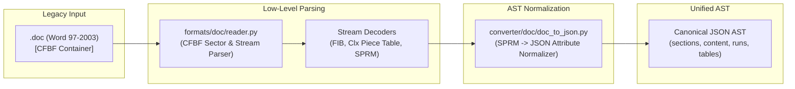

# Legacy DOC to JSON Bridge & Parity Mapping

## 1. Bridge Architecture & Goals

The `docx-bridge` engine is designed to decouple document storage mechanics from document semantic representation. Both modern DOCX and legacy DOC formats bridge to the exact same canonical JSON AST.

---

## 2. Binary Property to AST Mapping Rules

### 2.1 Character Formatting Normalization

| Legacy SPRM | Binary Data Type | AST Run Property | Transformation Rule |
| :--- | :--- | :--- | :--- |
| `sprmCFBold` | `uint8` (0 or 1) | `bold` | `bool(val)` |
| `sprmCFItalic` | `uint8` (0 or 1) | `italic` | `bool(val)` |
| `sprmCKul` | `uint8` (0..10) | `underline` | Mapped via `config/doc.json` `underline_values` (`1="single"`, `3="double"`, etc.) |
| `sprmCHps` | `uint16` (half-points) | `size` | Direct half-points integer (`24` = $12\text{ pt}$) |
| `sprmCColor` | `uint32` (BGR) | `color` | Byte-swapped to 6-char Hex RGB (`f"{r:02X}{g:02X}{b:02X}"`) |
| `sprmCRgFtc0` | `uint16` (Font Index) | `font` | Looked up in `STTBF` Font Table string array |

### 2.2 Paragraph Formatting Normalization

| Legacy SPRM | Binary Data Type | AST Paragraph Property | Transformation Rule |
| :--- | :--- | :--- | :--- |
| `sprmPJc` | `uint8` (0..3) | `align` | `0="left"`, `1="center"`, `2="right"`, `3="both"` |
| `sprmPDyaBefore` | `uint16` (twips) | `spacing.before` | Direct dxa integer |
| `sprmPDyaAfter` | `uint16` (twips) | `spacing.after` | Direct dxa integer |
| `sprmPDyaLine` | `int16` | `spacing.line` | Converted to standard line spacing ratio |
| `sprmPDxaLeft` | `int16` (twips) | `indent.left` | Direct dxa integer |
| `sprmPDxaLeft1` | `int16` (twips) | `indent.firstLine` | Direct dxa integer (negative = hanging indent) |
| `sprmPIlfo` | `uint16` (LFO index) | `numbering.id` | Mapped to unified list identifier |

### 2.3 Section Geometry Normalization

Legacy section descriptors (`SED` / `SEP`) map directly into the AST `page` block:
- `sprmSDmPaperReq` (Paper code 9 = A4, 1 = Letter, 5 = Legal)
- `sprmSDyaTop`, `sprmSDyaBottom`, `sprmSDxaLeft`, `sprmSDxaRight` map to `page.margins` in dxa.

---

## 3. Parity Guarantees

Because the output of `doc_to_json` conforms to the identical schema as `docx_to_json`:
1. Any legacy `.doc` can be converted to JSON and immediately recompiled into modern `.docx` via `json_to_docx`:
   $$\text{.doc} \xrightarrow{\text{doc\_to\_json}} \text{JSON AST} \xrightarrow{\text{json\_to\_docx}} \text{.docx}$$
2. Modern AI tools and processors only need to interface with one single schema.
