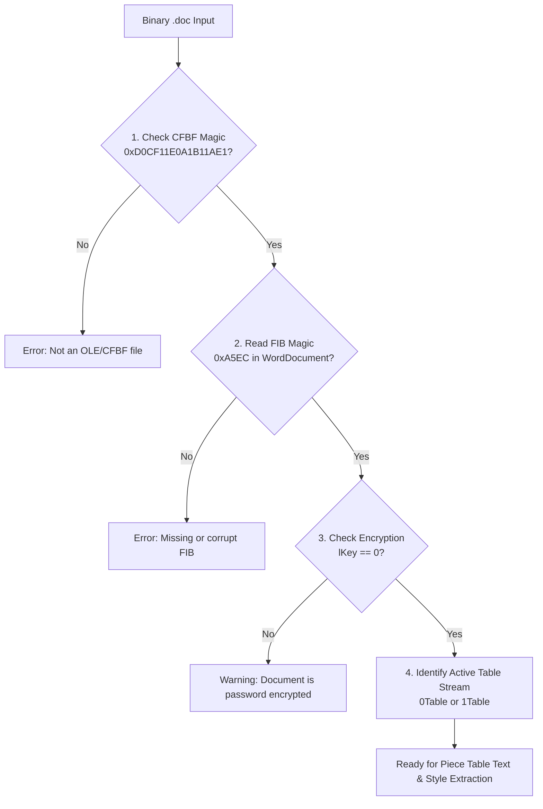

# AI Agent Guide: Binary DOC Analysis & Diagnostics

## 1. Scope & Objective

This document equips autonomous AI agents and diagnostic scripts to analyze, debug, and extract structures from legacy Microsoft Word binary files (`.doc`).

Unlike text-based JSON or XML formats, binary formats require strict byte-level verification, offset calculations, and endianness handling.

---

## 2. Diagnostic Heuristics for AI Agents

When an AI agent is requested to inspect or troubleshoot a `.doc` file, it should execute the following 4-step diagnostic verification:



---

## 3. Fast Hex & Stream Inspection Script

AI agents can run this lightweight diagnostic script to inspect any `.doc` binary without external dependencies:

```python
import struct
from pathlib import Path

def diagnose_doc_file(file_path: str) -> dict:
    data = Path(file_path).read_bytes()

    # 1. CFBF Magic check
    cfbf_magic = data[:8]
    is_cfbf = (cfbf_magic == b"\xD0\xCF\x11\xE0\xA1\xB1\x1A\xE1")

    report = {
        "is_cfbf": is_cfbf,
        "file_size": len(data),
        "status": "VALID_CFBF" if is_cfbf else "INVALID_CONTAINER"
    }

    if not is_cfbf:
        return report

    # 2. Extract sector size
    sector_shift = struct.unpack_from("<H", data, 30)[0]
    sector_size = 1 << sector_shift
    report["sector_size"] = sector_size

    # Look for WordDocument FIB magic 0xA5EC inside first sectors
    fib_offset = data.find(b"\xEC\xA5")
    if fib_offset != -1:
        w_ident, n_fib = struct.unpack_from("<HH", data, fib_offset)
        report["fib_found"] = True
        report["n_fib_hex"] = hex(n_fib)
        report["word_version"] = {
            0x00C1: "Word 6.0/95",
            0x00C3: "Word 97",
            0x00D9: "Word 2000",
            0x0101: "Word 2002",
            0x010C: "Word 2003",
            0x0112: "Word 2003 SP3"
        }.get(n_fib, f"Unknown ({hex(n_fib)})")
    else:
        report["fib_found"] = False

    return report

if __name__ == "__main__":
    import sys
    if len(sys.argv) > 1:
        import pprint
        pprint.pprint(diagnose_doc_file(sys.argv[1]))
```

---

## 4. Troubleshooting Encrypted & Protected Files

If `lKey` (offset `14` of the FIB base header) is non-zero, the `.doc` file uses Office Binary Document Password Encryption (RC4 / XOR obfuscation).

AI agents should detect this early:
```python
l_key = struct.unpack_from("<i", word_doc_stream, 14)[0]
if l_key != 0:
    raise PermissionError("Document is encrypted with a password and cannot be converted without credentials.")
```

---

## 5. Converting Extracted Text to Canonical AST

When an AI agent reconstructs text from a `.doc` piece table, it should normalize it directly into the `docx-bridge` JSON format:

```json
{
  "sections": [
    {
      "page": {
        "size": "letter",
        "orientation": "portrait"
      },
      "content": [
        {
          "style": "Normal",
          "text": "Extracted text content from piece table."
        }
      ]
    }
  ]
}
```
This enables immediate compilation into modern `.docx` packages using `converter.docx.json_to_docx`.
