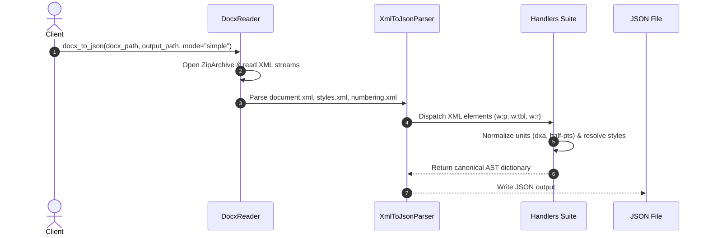
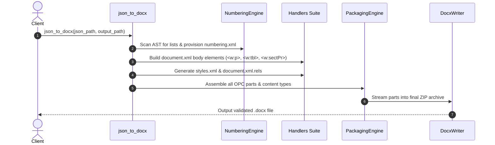

# DOCX Architecture & Packaging Pipeline

## 1. Open Packaging Conventions (OPC) Structure

A `.docx` file is a ZIP archive conforming to the Open Packaging Conventions (ECMA-376 Part 2). The directory structure generated and consumed by `docx-bridge` follows this exact standard:

```text
package.docx (ZIP Root)
├── [Content_Types].xml               # MIME-type declarations for all package parts
├── _rels/
│   └── .rels                         # Package-level relationship definitions
├── docProps/
│   ├── app.xml                       # Extended application metadata (pages, words, app version)
│   └── core.xml                      # Dublin Core metadata (title, author, created, modified)
└── word/
    ├── document.xml                  # Main document body containing text, tables, sections
    ├── styles.xml                    # Style definitions (Normal, Heading1..9, ListBullet, etc.)
    ├── numbering.xml                 # Abstract numbering definitions & concrete list instances
    ├── fontTable.xml                 # Embedded font definitions and character sets
    ├── settings.xml                  # Document-wide parameters (zoom, compatibility, proofing)
    ├── webSettings.xml               # HTML/Web preview settings
    ├── _rels/
    │   └── document.xml.rels         # Relationships from document.xml to styles, numbering, images
    └── media/                        # Embedded binary assets
        ├── image1.png
        └── image2.jpeg
```

---

## 2. Package Assembly Engine (`packaging.py`)

The packaging engine ([`converter/docx/packaging.py`](file:///home/omkar/Documents/docx-bridge/converter/docx/packaging.py)) dynamically constructs the OPC container:

1. **Content Type Registration**: Automatically maps part extensions and overrides in `[Content_Types].xml` using [`config/content-types.json`](file:///home/omkar/Documents/docx-bridge/config/content-types.json).
2. **Relationship Indexing**: Builds both root relationships (`_rels/.rels` targeting `officeDocument`) and document-level relationships (`word/_rels/document.xml.rels` targeting styles, numbering, header/footer, and media).
3. **Media Bundling**: Extracts base64 or file-referenced images into `word/media/` and assigns unique relationship IDs (`rIdN`).

---

## 3. Bi-Directional Conversion Pipeline

### 3.1 Pipeline A: DOCX to JSON (`docx_to_json.py`)



Key steps in `docx_to_json`:
- **Document Unpacking**: `DocxReader` safely reads XML contents into memory without unzipping to disk.
- **Style Merging**: Styles parsed from `word/styles.xml` are merged into the document dictionary.
- **Numbering Resolution**: Bullet lists and ordered numbering references (`w:numId`, `w:ilvl`) are resolved to their abstract list definitions, prefix symbols, and indents.
- **Media Preservation**: Inline images in `word/media/` are mapped to base64 data URLs or asset references.

### 3.2 Pipeline B: JSON to DOCX (`json_to_docx.py`)



Key steps in `json_to_docx`:
- **Pre-flight AST Scanning**: Automatically provisions bullet and numeric numbering definitions in `word/numbering.xml` for all lists in the JSON AST.
- **Section & Page Assembly**: Converts top-level section properties (`size`, `orientation`, `margins`, `header`, `footer`) into OpenXML `<w:sectPr>` tags.
- **Schema Strictness**: Automatically reorders child XML tags inside `<w:pPr>` and `<w:rPr>` according to ISO/IEC 29500 schema requirements to ensure Microsoft Word opens the file without repair warnings.
- **Safe Packaging**: Atomic zip generation ensures no corrupted archive is created if an error occurs.
